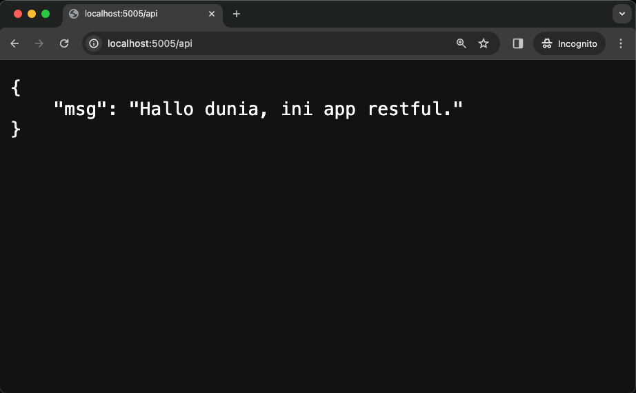
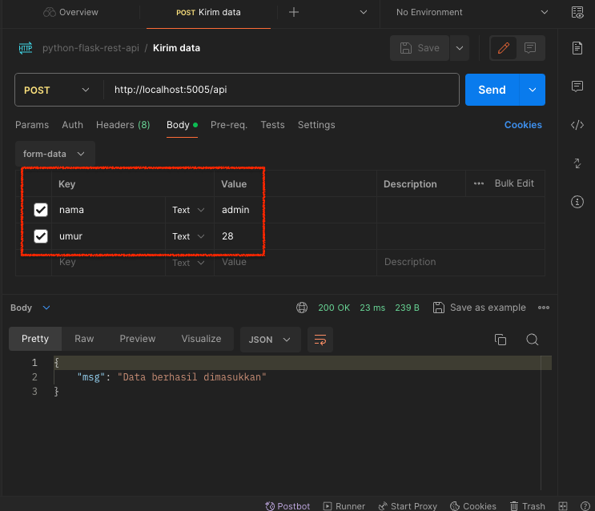
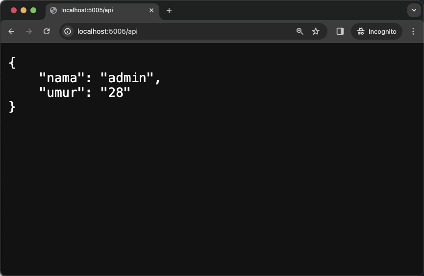
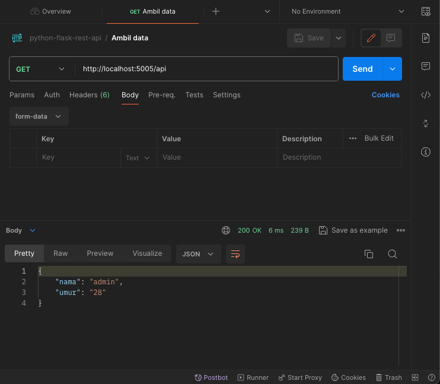

# Python RestAPI using Flask and virtualenv

---

#### Begin Project :

        ❯ virtualenv myenviro

        ❯ pip install virtualenv

        ❯ source myenviro/bin/activate

    # install di dalam environment

        ❯ pip install flask

        ❯ pip install flask-restful
        
        ❯ pip install flask-cors

    # untuk mengecek apa saja yang telah terinstal

        ❯ pip list

#### &#x1F680; Code [001app.py]:

        from crypt import methods
        from urllib import response
        from flask import Flask, request
        from flask_restful import Resource, Api
        from flask_cors import CORS

        app=Flask(__name__)

        api=Api(app)

        CORS(app)

        class ContohResource(Resource):

            def get(self):
                response={"msg":"Hallo dunia, ini app restful."}
                return response

        # setup resourcenya
        api.add_resource(ContohResource, "/api", methods=["GET"])

        if __name__ == "__main__":
            app.run(debug=True, port=5005)

#### &#x1F3C3; Menjalankan code :

    ❯  python3 001app.py

        op:

            * Serving Flask app '001app'
            * Debug mode: on
            WARNING: This is a development server. Do not use it in a production deployment. Use a production WSGI server instead.
            * Running on http://127.0.0.1:5005
            Press CTRL+C to quit
            * Restarting with stat
            * Debugger is active!
            * Debugger PIN: 106-564-594
            127.0.0.1 - - [05/Mar/2024 08:22:11] "GET /api HTTP/1.1" 200 -

## &#x1F525; Result :

Buka pada browser 

    URL http://localhost:5005/api

    op:
    {
        "msg": "Hallo dunia, ini app restful."
    }

    

### Pada contoh code selanjutnya akan method POST data.

---

#### &#x1F680; Code [002app.py]: 

        from crypt import methods
        from urllib import response
        from flask import Flask, request
        from flask_restful import Resource, Api
        from flask_cors import CORS

        app=Flask(__name__)

        api=Api(app)

        CORS(app)

        identitas={} 

        class ContohResource(Resource):

            def post(self):
                nama=request.form["nama"] 
                umur=request.form["umur"]
                identitas["nama"]=nama
                identitas["umur"]=umur
                response={"msg":"Data berhasil dimasukkan"} 
                return response 

            def get(self):
                return identitas
        
        api.add_resource(ContohResource, "/api", methods=["GET","POST"])

        if __name__ == "__main__":
            app.run(debug=True, port=5005)

#### &#x1F3C3; Menjalankan code :

    ❯ python3 002app.py

        * Serving Flask app '002app'
        * Debug mode: on
        WARNING: This is a development server. Do not use it in a production deployment. Use a production WSGI server instead.
        * Running on http://127.0.0.1:5005
        Press CTRL+C to quit
        * Restarting with stat
        * Debugger is active!
        * Debugger PIN: 106-564-594 

## &#x1F525; Result :

- dapat menggunakan postman, buat request POST, dan masukkan key pada multiplatform.

    

atau curl :

    curl --location 'http://localhost:5005/api' \
    --form 'nama="admin"' \
    --form 'umur="28"'    

- tangkap data pada method GET dapat menggunakan postman atau pada browser.

    

browser

    

postman

atau curl :

    curl --location 'http://localhost:5005/api'

---